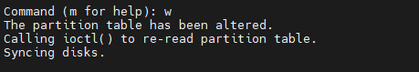
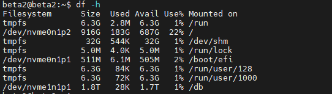

**"Create a Partition in Linux"**

Step 1: - View all the partitions currently on your system by using the following command :- 

`   `$ sudo fdisk -l

Figure 1

Step2 -

1) Choose one disk from this list to partition [disk path]  For ex:-  Selected disk path from Figure 1 is:- /dev/nvme1n1

`   `$ sudo fdisk [disk path] 

` `b) Using the command mode

`   `- choose prompt 'n'

`   `- choose promot 'p'

`   `- partition number choose default prompt '1'

`   `- first sector or specify the size for your partition 

Figure 2

` `c) Setting the partition type

`   `- change the ID for our partition, we will use the command ‘t’. 

`   `- HEX code 8e is the partition ID for the ‘Linux LVM’ partition type, choose '8e'

Figure 3

` `d) To see the detailed list of partitions choose 'p'

Figure 4

` `e) To save changes , choose 'w'

Figure 5

Step3 -  Formatting a partition 

$ sudo mkfs.ext4 [partition path] 

Partition path is:- /dev/nvme1n1p1

Step4 -  Create a folder on root 

$ sudo mkdir [folder name]         (/db is our folder name.)

Step5 -Mount the folder on crated partition 

Partition path :- /dev/nvme1n1p1

Folder name:- /db

$ sudo mount -t auto [partition path] [Folder name]

Step6:- Check the disk partiton by :-

$ df -h

Figure 6

